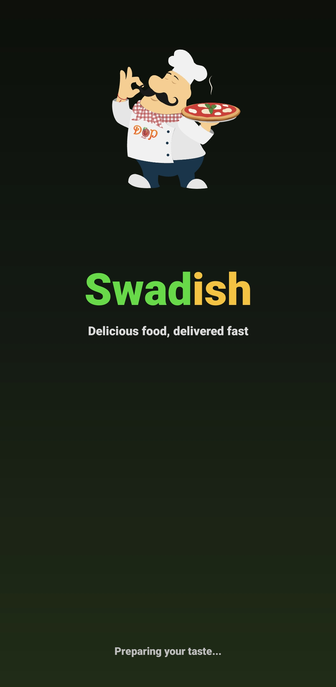
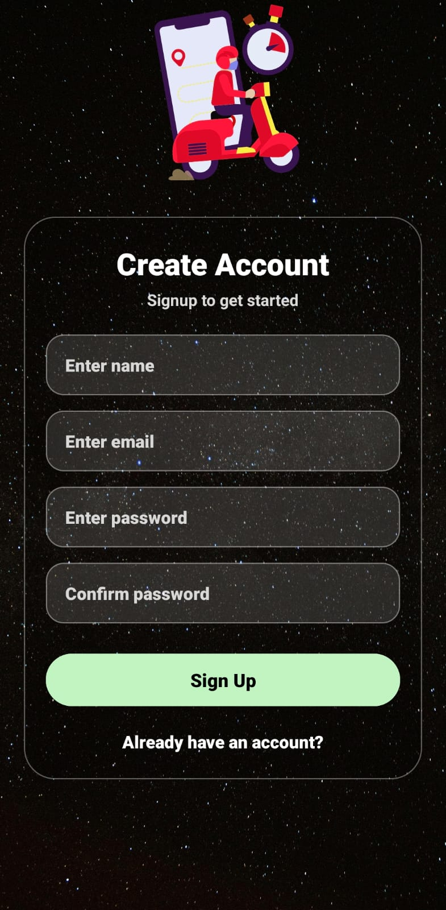
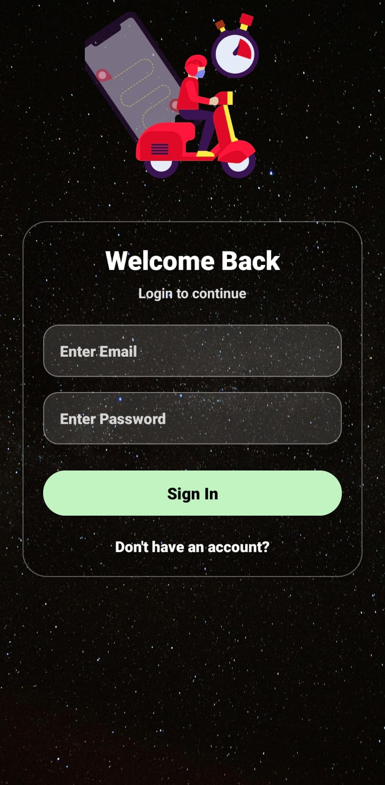
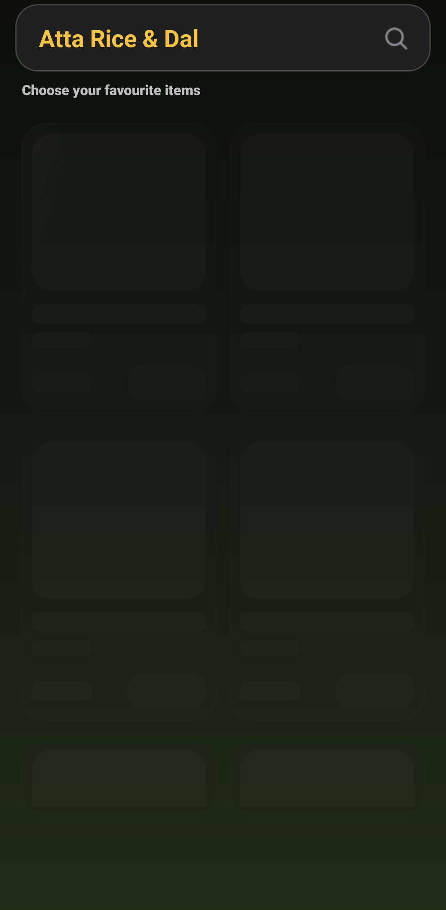
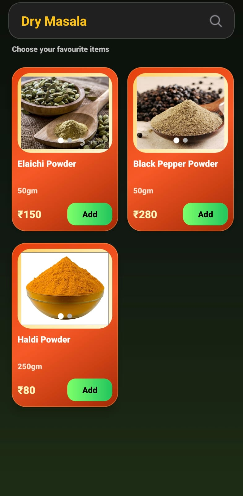
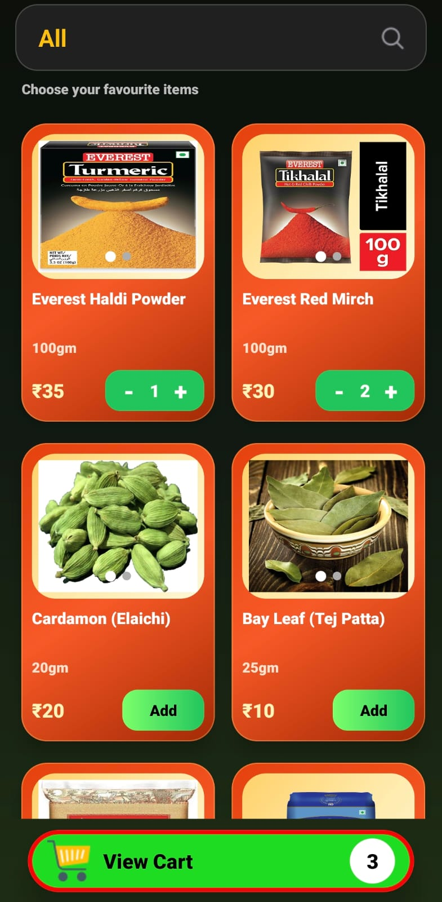
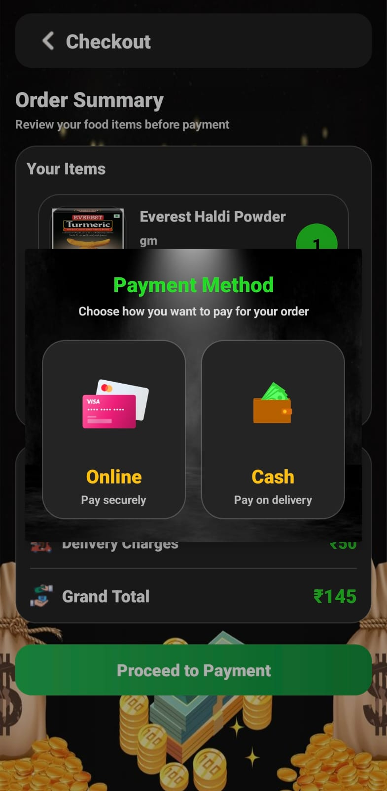
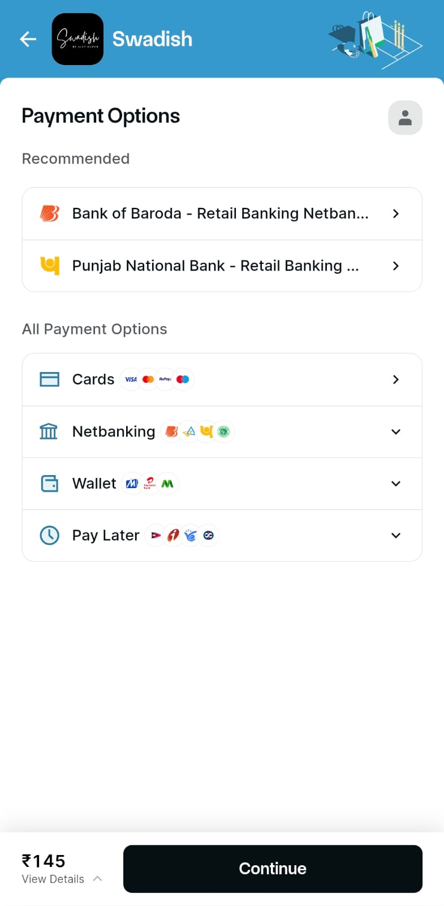
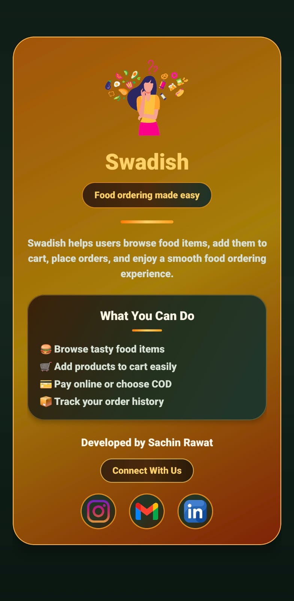
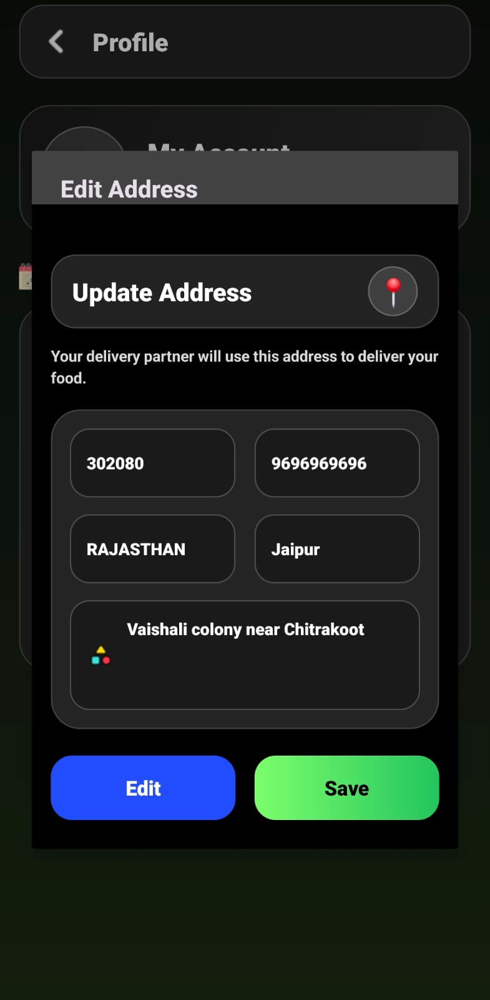

# Swadish_User_A_Delivery_App
An Android app built with Kotlin, XML, and Firebase. Users can browse menus, place orders, track deliveries in real-time, and enjoy a smooth and intuitive interface.

<h3 align="center">📱 App Screenshots</h3>

User-side UI flow of the Swadish Food Delivery Application

<table align="center" cellpadding="10">
<tr>
  <td></td>
  <td></td>
  <td></td>
  <td></td>
  <td></td>

</tr>
<tr>
  <td></td>
  <td></td>
  <td></td>

  <td></td>
  <td></td>
</tr>
<tr>
   <td></td>
  <td></td>
 <td></td>
  <td></td>
</tr>
</table>

